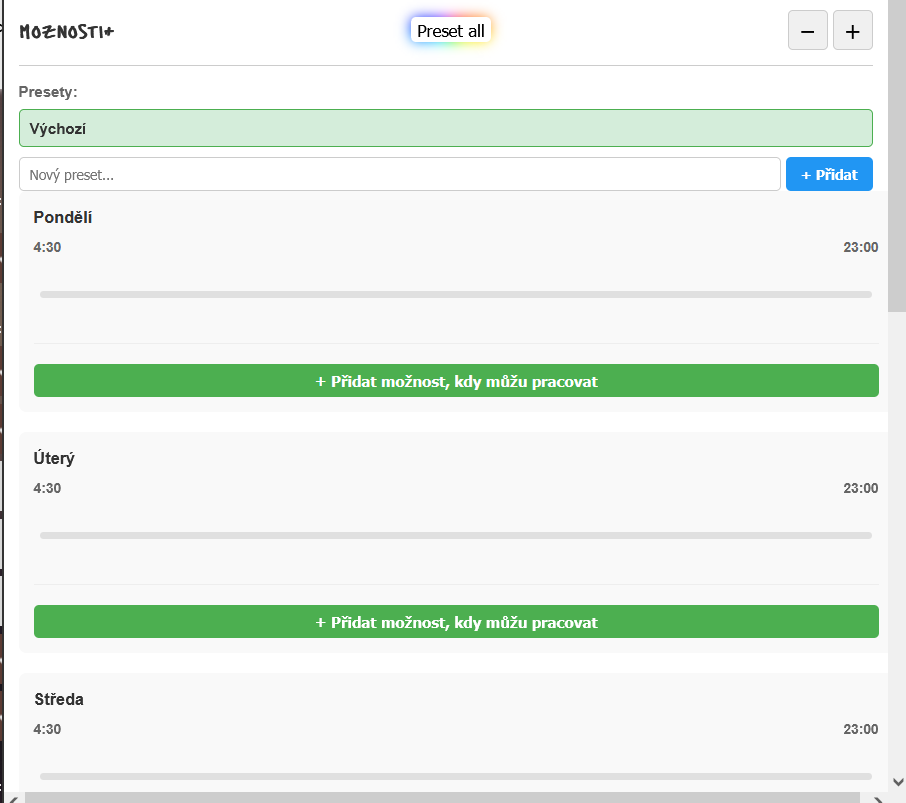
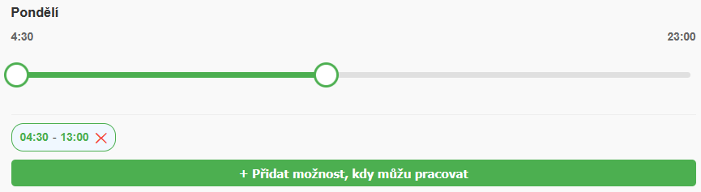
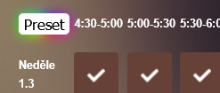

## Installation
Download .xpi from releases, if you download it in firefox, it will install automatically, otherwise you'll have to open the file with firefox.

Then approve the instalation in the top right corner:

## Usage
This extension allows you to preset a week of availabilities in an intelligent UI and apply it to the moznosti form automatically.

when you navigate to Možnosti/Napsat
you'll see the default size moznosti+ window in the top right.
You can make it larger and smaller using the + and - buttons highlighted below.

## Big view usage
This is where you set up your availability. Precisely, on the sliders.

The sliders are empty by default, but you can add availability sliders with the green button.

Then drag the green nodes to highlight the time, when you can work.
Remove a slider by hitting the red X next to the corresponding time.

## Presets
All of your availability settings are saved to the "Výchozí" preset by default. You can create an empty preset by filling its name in place od the "Nový preset..." text and hitting the blue button.

After that you can switch between active presets by clicking on their names.

## Filling out the moznosti form automatically

Click the rainbow button "Preset" in the page to fill out the corresponding week.

Or click the "Preset all" Rainbow button near the top of the moznosti+ view to fill out the whole form.
